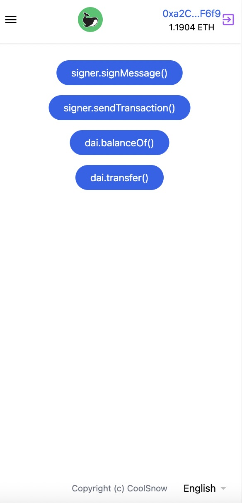

⚡️ Web3 frontend template with React & Vite & TypeScript. 

## Features & Plugins

- React, [Vite](https://github.com/vitejs/vite), ESlint - born with fastness

- [web3model](https://github.com/Web3Modal/web3modal)

- [ethers.js](https://github.com/ethers-io/ethers.js)
  
- i18n, store - works out-of-box

- [TailwindCSS](https://github.com/tailwindlabs/tailwindcss) - CSS framework for rapid UI development

- TypeScript

## ScreenShot

   

## Usage

1. Clone this repository
2. npm install
3. npm run dev

# Author

CoolSnow

Email: coolsnow2020@gmail.com

Twitter: https://twitter.com/CoolSnow0927
